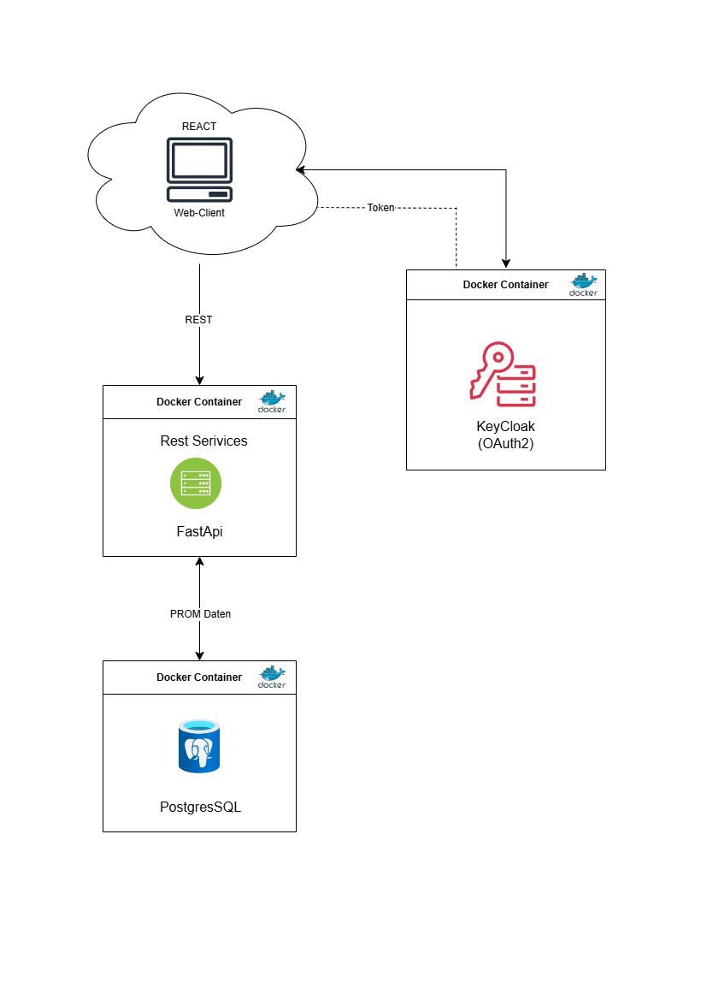

# SSN Datenqualitäts-Dashboard

**Bachelor-Thesis @ FHNW – Medizininformatik**  
**Thema:** Datenqualitätsmanagement in der Sarkomversorgung  
**Start:** 05.05.2025  
**Abgabe:** 18.08.2025 um 12:00 Uhr  
**Ort:** Kantonsspital Luzern und FHNW (Muttenz)  
**Betreuung:** Dr. Abdullah Kahraman und Dr. Philip Heesen  
**Auftraggeber:** Dr. Bruno Fuchs und Dr. Philip Heesen  
**Experte:** Dr. Fabian Arnold

---

## Projektbeschreibung

Das Schweizer Sarkom Netzwerk (SSN) speichert klinische Daten in einer PostgreSQL-Datenbank.  
Ziel dieses Projekts ist die Entwicklung eines webbasierten Dashboards, das die Datenqualität in Echtzeit überwacht und visualisiert. Dazu zählen:

- **Vollständigkeits-Checks**
- **Inhaltliche Korrektheit & Plausibilität**
- **Konsistenzprüfungen**
- **Alerts** bei fehlenden oder fehlerhaften Einträgen
- **Visualisierungen** für PROMs & CROMs

Das Dashboard richtet sich an Ärzt:innen, Datenmanager:innen und Forschende in der Sarkomversorgung.

[Offizielle Projektbeschreibung (PDF)](./docs/Projektbeschreibung.pdf)

---

## Meilensteine

| Milestone      | Zeitraum             | Beschreibung                                |
|----------------|----------------------|---------------------------------------------|
| Sprint 0       | 07.04 – 18.04.2025   | Projektstart, GitLab, Protokoll, Struktur   |
| Sprint 1       | 05.05 – 16.05.2025   | Recherche & Konzept                         |
| Sprint 2       | 19.05 – 30.05.2025   | Architektur planen, Tools auswählen         |
| Sprint 3       | 02.06 – 13.06.2025   | Backend-Prototyp (FastAPI, SQL)             |
| Sprint 4       | 16.06 – 27.06.2025   | Frontend-Dashboard (React, Charts)          |
| Sprint 5       | 30.06 – 11.07.2025   | Tests, Optimierungen                        |
| Sprint 6       | 14.07 – 25.07.2025   | Thesis schreiben                            |
| Sprint 7       | 28.07 – 08.08.2025   | Review, Abgabe                              |

---

## Verwendete Tools & Technologien

| Bereich         | Technologie                                  |
|-----------------|----------------------------------------------|
| **Frontend**    | React, TypeScript, Material UI, i18next      |
| **Backend**     | FastAPI (Python), SQLAlchemy, APScheduler    |
| **Datenbanken** | PostgreSQL (CROMs), MySQL (PROMs)            |
| **Auth**        | Keycloak                                     |
| **Container**   | Docker, Docker Compose                       |
| **Sonstiges**   | Axios, Recharts, Chart.js                    |

---

## Projektstruktur

```plaintext
ssn-datenqualitaet/
├── app/
│   ├── backend/       # FastAPI-Backend
│   ├── frontend/      # React-Frontend
├── docs/              # Konzept, Literatur, Protokolle
└── docker-compose.yml # Container Setup
````

---

## Systemarchitektur



---

## Features

* Datenqualitätsmetriken: Vollständigkeit, inhaltliche Korrektheit, Konsistenz, Aktualität, Eindeutigkeit
* Getrennte und kombinierte Anzeige von PROM- und CROM-Daten
* PROM-Detailansichten mit Diagrammen (z. B. EQ-5D, Biopsie)
* Alerts mit Schwellenwerten, Feldprüfungen, Vergleichsregeln
* Mehrsprachige UI (DE, EN, FR)

---

## Installation

### Voraussetzungen

* Docker & Docker Compose
* Node.js ≥ 18.x
* Python ≥ 3.10

### `.env`-Dateien erstellen

**Backend `.env`**

```env
POSTGRES_USER=postgres
POSTGRES_PASSWORD=postgres
POSTGRES_DB=croms_db
POSTGRES_HOST=postgres
POSTGRES_PORT=5432

MYSQL_USER=mysqluser
MYSQL_PASSWORD=mysqlpass
MYSQL_DB=proms_db
MYSQL_HOST=mysql
MYSQL_PORT=3306

KEYCLOAK_URL=http://keycloak:8080
KEYCLOAK_REALM=dashboard
KEYCLOAK_CLIENT_ID=dashboard-client
KEYCLOAK_CLIENT_SECRET=...

EMAIL_HOST=smtp.gmail.com
EMAIL_PORT=587
EMAIL_USER=...
EMAIL_PASSWORD=...(APP Passwort)
```

**Frontend `.env`**

```env
VITE_API_BASE_URL=http://localhost:8000/api
VITE_KEYCLOAK_URL=http://localhost:8080
VITE_KEYCLOAK_REALM=dashboard
VITE_KEYCLOAK_CLIENT_ID=dashboard-client
```

---

### Start mit Docker

```bash
docker-compose up --build
```

* Frontend: [http://localhost:5173](http://localhost:5173)
* Backend API: [http://localhost:8000](http://localhost:8000)
* Swagger: [http://localhost:8000/docs](http://localhost:8000/docs)
* Keycloak: [http://localhost:8080](http://localhost:8080)

---

## 🔧 Entwicklung (ohne Docker)

### Frontend

```bash
cd app/frontend
npm install
npm run dev
```

### Backend

```bash
cd app/backend
pip install -r requirements.txt
uvicorn main:app --reload --host 0.0.0.0 --port 8000
```
---