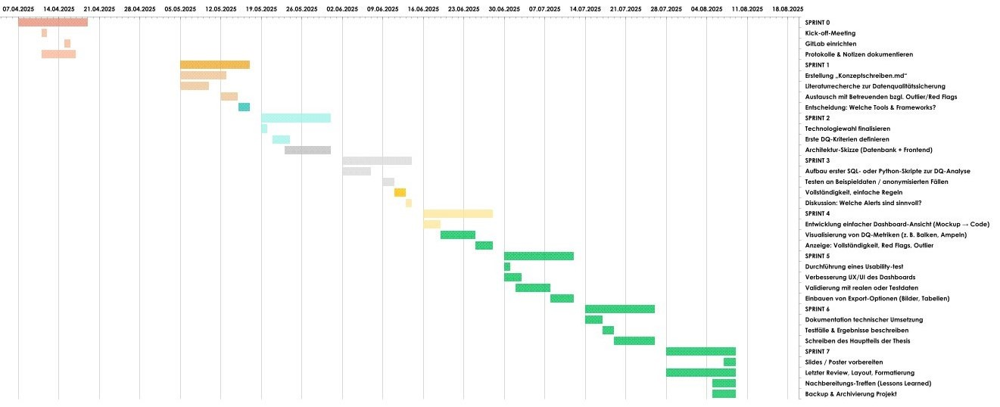

# Konzeptschreiben: Datenqualitäts-Dashboard für PROM-Daten von Sarkom-Patient:innen  

## 1. Einleitung

Am Kantonsspital Luzern (LUKS) werden im Rahmen der Sarkomversorgung regelmässig patientenberichtete Ergebnisdaten  mittels strukturierter Fragebögen (PROMs) erhoben. Diese Daten spielen eine zentrale Rolle bei der Beurteilung von Gesundheitszustand, Therapieerfolg und Versorgungsqualität. Damit daraus verlässliche Erkenntnisse abgeleitet werden können, ist eine kontinuierliche Überwachung der Datenqualität erforderlich. Fehlende oder unplausible Angaben können wissenschaftliche Auswertungen verzerren, wenn sie nicht erkannt und berücksichtigt werden.

Im Rahmen dieser Bachelorarbeit soll ein webbasiertes Dashboard zur Überwachung und Visualisierung der Datenqualität entwickelt werden. Es fokussiert sich auf die Erkennung unvollständiger oder auffälliger Einträge, die Identifikation sogenannter „Red Flags“ sowie die Bereitstellung automatisierter Benachrichtigungen.

Im Rahmen dieser Bachelorarbeit soll ein webbasiertes Dashboard zur Überwachung und Visualisierung der Datenqualität entwickelt werden, inspiriert durch praxiserprobte Ansätze wie dem RA PRO Dashboard von Schmajuk et al. (2024), das erfolgreich die Integration von Patient-Reported Outcomes in die klinische Praxis unterstützt hat (Schmajuk et al., 2024).

### 1.1 Fragestellung
Wie kann ein webbasiertes Dashboard die Vollständigkeit und Qualität von PROM-Daten bei Sarkom-Patient:innen am Kantonsspital Luzern in Echtzeit überwachen und nutzerfreundlich visualisieren, um wissenschaftliche Auswertungen zu unterstützen und Red Flags frühzeitig zu erkennen?

## 2. Ziele und Zielgruppen

Ziel dieser Arbeit ist die Konzeption und prototypische Umsetzung eines Dashboards zur Echtzeitüberwachung der Datenqualität von PROM-Daten. Dabei werden folgende Teilziele verfolgt:

- [Literaturrecherche zu Best Practices im Bereich der Datenqualitätssicherung](Literaturrecherche%20Datenqualitätssicherung.md)  
- [Entwicklung eines modularen Datenqualitätskonzepts (DQ-Konzept) für klinische Daten](Datenqualitätskonzept.md)
- [Auswahl geeigneter Technologien und Visualisierungstools](Technologien%20und%20Visualisierungstools.md)
- Aufbau eines Dashboards (Prototyp) zur Darstellung relevanter Metriken
- Umsetzung einfacher Prüfregeln (z. B. Vollständigkeit, Ausreissererkennung)
- Definition und Simulation von Benachrichtigungsmechanismen

Die Zielgruppe umfasst klinisch tätige Ärzt:innen, Datenmanager:innen und Forschende am LUKS. Das System ist für den internen Gebrauch bestimmt und wird nicht von Patient:innen verwendet.

## 3. Beschreibung des Konzepts

Das Dashboard basiert auf der internen PostgreSQL-Datenbank des LUKS, in der PROM-Daten pseudonymisiert gespeichert und regelmässig aktualisiert werden. Die Datenbank befindet sich derzeit im Aufbau durch die Firma Renuo (Stand 08.05.2025). 

Folgende konzeptionelle Komponenten sind vorgesehen:

- Ein Kriterienkatalog zur Beurteilung der Datenqualität (z. B. Vollständigkeit, Konsistenz, Eindeutigkeit, Plausibilität)  
- Definition typischer Red Flags (z.B. fehlende Einträge, unrealistische Werte)    
- Entwicklung eines Visualisierungskonzepts für eine nutzerfreundliche Darstellung

Die Auswahl und Strukturierung dieser Dimensionen orientiert sich an etablierten Konzepten der Datenqualitätsforschung, insbesondere an den Arbeiten von Pipino et al. (2002), die Vollständigkeit, Konsistenz, Genauigkeit und Plausibilität als zentrale Dimensionen operationalisiert haben (Pipino, Lee & Wang, 2002).

Die technische Umsetzung erfolgt in einem flexiblen Webstack, basierend auf React (Frontend) und FastAPI (Backend). Ein Hosting über Google Cloud ist möglich.

Beispielhafte Funktionen des Dashboards:
- Übersicht über fehlende Fragebogeneinträge pro Patient:in  
- Aggregierte Auswertungen zur Vollständigkeit je Fragebogen  
- Ob ein Fall bestimmte Red Flags aufweist (z. B. fehlende Bildgebung)  

Die Auswahl geeigneter Technologien sowie ein Überblick zu deren Funktionen und Einsatz im geplanten Dashboard sind im separaten Dokument [Technologien und Visualisierungstools](Technologien%20und%20Visualisierungstools.md) beschrieben.

### 3.1 Vergleichbare Ansätze
Ein vergleichbares Vorhaben wurde von Schmajuk et al. (2024) realisiert. In ihrer Arbeit wurde ein sogenanntes EHR-Sidecar-Dashboard („RA PRO Dashboard“) entwickelt, das patientenberichtete Outcome-Daten bei rheumatoider Arthritis systematisch erfasst, überwacht und in die klinische Entscheidungsunterstützung integriert. Der Entwicklungsprozess erfolgte schrittweise, von der Definition relevanter Metriken über die Backend-Integration bis zur nutzerfreundlichen Visualisierung im Klinikalltag.

Besonders relevant für die vorliegende Arbeit sind die folgenden Aspekte:

- Die klare Trennung zwischen PROM-Logik und klinischem System („Sidecar“-Architektur)   
- Die kontinuierliche Datenqualitätssicherung (z.B. Erkennung fehlender Werte)  
- Die Visualisierung individueller und aggregierter Trends zur Entscheidungsunterstützung

Obwohl sich das RA PRO Dashboard auf eine andere Patient:innengruppe bezieht, liefert es wertvolle Impulse für den strukturierten Aufbau eines datenqualitätsorientierten Dashboards in der Sarkomversorgung.

## 4. Nutzen und Vorteile

Ein Dashboard zur Datenqualitätsüberwachung ermöglicht:

- Frühzeitige Erkennung von Lücken und Auffälligkeiten in PROM-Daten    
- Direkte Rückmeldung an die verantwortliche Datenmanager:innen (z. B. durch Alerts)  

## 5. Risiken und Herausforderungen

- Verzögerungen im Datenbankaufbau: Die produktive Datenbank ist aktuell noch im Aufbau.    
- Die Definition sinnvoller Prüfregeln (z.B. für Ausreisser) erfordert medizinische Fachexpertise.   
- Visualisierungen müssen sowohl für medizinisches als auch wissenschaftliches Personal verständlich sein.     
- Abhängig von der Toolauswahl kann es eine technische Einarbeitungsphase geben, insbesondere bei der Anbindung an bestehende Systeme oder der Konfiguration des Datenzugriffs.  

## 6. Zeitplan und Ressourcen

Start der Bachelorarbeit: **05.05.2025**  
Betreuer: **Dr. Abdullah Kahraman und Dr. Philip Heesen (LUKS)**  
Auftraggeber: **Dr. Bruno Fuchs und Dr. Philip Heesen**
Experte: **Dr. Fabian Arnold**

Die Arbeit ist auf 15 Wochen angelegt und orientiert sich an einem iterativen, agilen Vorgehen in Sprints. Der Zeitplan kann bei Bedarf agil angepasst werden, z.B. bei Verzögerungen im Datenbankaufbau oder Technologieentscheidungen.

### Visueller Sprint-Zeitplan

### Sprint-Zeitplan – Bachelorarbeit Datenqualitätsmanagement in der Sarkomversorgung @KSL    

| AUFGABENNAME                                        | FUNKTIONSTYP                   | STARTDATUM  | ENDDATUM    | DAUER (Tage) |
|-----------------------------------------------------|--------------------------------|-------------|-------------|--------------|
| **SPRINT 0**                                        | **Setup & Orientierung**           | **07.04.2025**  | **18.04.2025**  | **12**            |
| Kick-off-Meeting                                    |                                | 11.04.2025  | 11.04.2025  | 1            |
| GitLab einrichten                                   |                                | 15.04.2025  | 15.04.2025  | 1            |
| Protokolle & Notizen dokumentieren                  |                                | 11.04.2025  | 16.04.2025  | 6            |
| **SPRINT 1**                                        | **Literatur & Konzept**            | **05.05.2025**  | **16.05.2025**  | **12**           |
| Erstellung „Konzeptschreiben.md“                    |                                | 05.05.2025  | 12.05.2025  | 8           |
| Literaturrecherche zur Datenqualitätssicherung      |                                | 05.05.2025  | 09.05.2025  | 5            |
| Austausch mit Betreuenden bzgl. Outlier/Red Flags   |                                | 12.05.2025  | 14.05.2025  | 3            |
| Entscheidung: Welche Tools & Frameworks?            |                                | 15.05.2025  | 16.05.2025  | 2            |
| **SPRINT 2**                                        | **Tool-Setup & Architektur**       | **19.05.2025**  | **30.05.2025**  | **12**           |
| Technologiewahl finalisieren                        |                                | 19.05.2025  | 19.05.2025  | 1            |
| Erste DQ-Kriterien definieren                       |                                | 21.05.2025  | 23.05.2025  | 3            |
| Architektur-Skizze (Datenbank + Frontend)           |                                | 23.05.2025  | 30.05.2025  | 9            |
| **SPRINT 3**                                        | **Prototyp Backend / DQ-Checks**   | **02.06.2025**  | **13.06.2025**  | **12**           |                |
| SQL- oder Python-Skripte zur DQ-Analyse             |                                | 02.06.2025  | 06.06.2025  | 5            |
| Testen an Beispieldaten                             |                                | 09.06.2025  | 10.06.2025  | 2            |
| Vollständigkeit, einfache Regeln                    |                                | 11.06.2025  | 12.06.2025  | 2            |
| Alerts diskutieren                                  |                                | 13.06.2025  | 13.06.2025  | 1            |
| **SPRINT 4**                                        | **Frontend / Dashboard-Prototyp**  | **16.06.2025**  | **27.06.2025**  | **12**          |
| Dashboard-Ansicht (Mockup → Code)                   |                                | 16.06.2025  | 18.06.2025  | 3            |                
| Visualisierung von DQ-Metriken                      |                                | 19.06.2025  | 24.06.2025  | 6            |                
| Anzeige: Vollständigkeit, Red Flags, Outlier        |                                | 25.06.2025  | 27.06.2025  | 3            |                
| **SPRINT 5**                                        | **Evaluation & Optimierung**       | **30.06.2025**  | **11.07.2025**  | **12**          |
| Usability-Test                                      |                                | 30.06.2025  | 30.06.2025  | 1            |      
| Verbesserung UX/UI                                  |                                | 30.06.2025  | 02.07.2025  | 3            |      
| Validierung mit Testdaten                           |                                | 02.07.2025  | 07.07.2025  | 6            |      
| Export-Optionen (Bilder, Tabellen)                  |                                | 08.07.2025  | 11.07.2025  | 4            |      
| **SPRINT 6**                                        | **Dokumentation & Vorbereitung**   | **14.07.2025**  | **25.07.2025**  | **12**          |
| Dokumentation technischer Umsetzung                 |                                | 14.07.2025  | 16.07.2025  | 3            |       
| Testfälle & Ergebnisse beschreiben                  |                                | 17.07.2025  | 18.07.2025  | 2                            |
| Schreiben Hauptteil Thesis                          |                                | 19.07.2025  | 25.07.2025  | 7                            |
| **SPRINT 7**                     | **Abgabe & Abschluss**             | **28.07.2025**  | **08.08.2025**  | **12**                           |
| Slides / Poster vorbereiten                         |                                | 07.08.2025  | 08.08.2025  | 2                            |
| Letzter Review, Layout, Formatierung                |                                | 28.07.2025  | 08.08.2025  | 12           |                
| Lessons Learned / Nachbereitungs-Treffen            |                                | 05.08.2025  | 08.08.2025  | 4            |                
| Backup & Archivierung                               |                                | 05.08.2025  | 08.08.2025  | 4            |                

## 7. Erfolgskriterien

- Vollständige, nachvollziehbare Dokumentation der Anforderungen und Konzepte  
- Entwicklung eines funktionierenden Dashboard-Prototyps mit echten oder simulierten Daten  
- Validierung durch Feedback von Betreuenden und potenzielle Nutzer:innen  

## 8. Schlussfolgerung und Ausblick

Mit der Entwicklung des Dashboards leistet die Arbeit einen Beitrag zur Sicherung der Datenqualität von PROM-Daten bei Sarkom-Patient:innen. In Zukunft könnten weitere Funktionalitäten, etwa KI-basierte Anomalieerkennung, integriert werden.

## 9. Referenzen

[1] Pipino, L.L., Lee, Y.W., & Wang, R.Y. (April 2002). *Data Quality Assessment*. Communications of the ACM, 45(4), 211–218.

[2] Schmajuk, G., Nasrallah, C., Berrean, B. et al. (2024). A step-by-step roadmap for the development and deployment of an electronic health record sidecar application that tracks patient outcomes: The RA PRO dashboard. Digital Health, 10, 1–15. https://doi.org/10.1177/20552076241288739.
---
Sivanajani Sivakumar