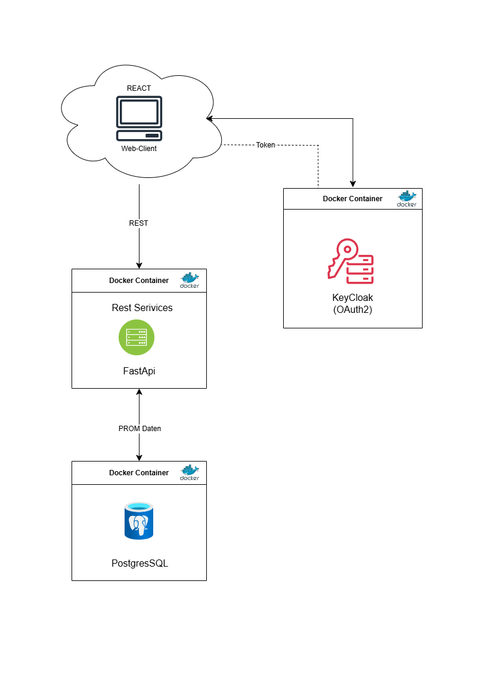

# Software Requirements Specification (SRS)

**Version:** 0.3  
**Datum:** 15.05.2025

**Erstellt von:**  
Sivakumar Sivanajani  

**Erstellt für:**  
Bachelor-Arbeit MI - Datenqualitätsmanagement in der Sarkomversorgung 
Dr. Abdullah Kahraman, Dr. Bruno Fuchs, Dr. Philip Heesen

## Änderungshistorie

| Datum     | Version |Autor*innen                   | Beschreibung             |
| -------- | ----------- |------------------------ | -------------------- |
| 01.05.25 | Version 0.1 | Sivanajani Sivakumar | Dokument erstellt. |
| 02.05.25 | Version 0.2 | Sivanajani Sivakumar | Technologieübersicht Kapitel eingefügt. |
| 15.05.25 | Version 0.3 | Sivanajani Sivakumar | Erste vollständige Version des SRS-Dokuments (vorläufiger Stand). |

## Inhaltsverzeichnis
1. [Einleitung](#1-einleitung)  
    [1.1 Zweck des Dokuments](#11-zweck-des-dokuments) 
    [1.2 Softwareprodukt Umfang](#12-softwareprodukt-umfang)   
    [1.3 Definitionen, Akronyme und Abkürzungen](#13-definitionen-akronyme-und-abkürzungen)  
    [1.4 Referenzen](#14-referenzen)  
    [1.5 Überblick vom SRS](#15-überblick-vom-srs)  
2. [Gesamtbeschreibung](#2-gesamtbeschreibung)  
    [2.1. Produktübersicht](#21-produktübersicht)  
    [2.2. Produktfunktionen](#22-produktfunktionen)   
    [2.2.1 Use Case Übersicht](#221-use-case-übersicht)  
    [2.3 Benutzermerkmale](#23-benutzermerkmale)  
    [2.4 Annahmen, Abhängigkeiten und Einschränkungen](#24-annahmen-abhängigkeiten-und-einschränkungen)    
3. [Spezifische Anforderungen](#3-spezifische-anforderungen)  
    [3.1 Externe Schnittstellenanforderungen](#31-externe-schnittstellenanforderungen)   
    [3.1.1 Benutzeroberfläche](#311-benutzeroberfläche)  
    [3.1.2 Hardware Schnittstellen](#312-hardware-schnittstellen)  
    [3.1.3 Software Schnittstellen](#313-software-schnittstellen)  
    [3.2 Funktionale Anforderungen](#32-funktionale-anforderungen)  
    [3.3 Nicht funktionale Anforderungen](#33-nicht-funktionale-anforderungen)  
    [3.3.1 Datenschutz](#331-datenschutz)  
    [3.3.2 Usability](#332-usability)  
    [3.3.3 Sicherheit](#333-sicherheit)  
    [3.3.4 Wartbarkeit](#334-wartbarkeit)  
    [3.4 Systemarchitektur](#34-systemarchitektur)  
    [3.5 Inverse Anforderungen](#35-inverse-anforderungen)  
    [3.6 Bewertungskriterien und Metriken](#36-bewertungskriterien-und-metriken)   
    [3.7 Technologieübersicht](#37-technologieübersicht)
---

## 1. Einleitung

In der Sarkomversorgung spielen strukturierte, qualitativ hochwertige Ergebnisdaten eine entscheidende Rolle für die Bewertung des Behandlungserfolgs und die patientenzentrierte Versorgung. Dabei werden sowohl Patient Reported Outcome Measures (PROMs) als auch Clinician Reported Outcome Measures (CROMs) erhoben. PROM-Daten stammen direkt von den Patient:innen (z.B. über Fragebögen), während CROM-Daten durch medizinisches Fachpersonal im Rahmen der klinischen Dokumentation erfasst werden. Beide Datentypen liefern wertvolle Informationen zum Gesundheitszustand, Therapieverlauf und zur Versorgungsqualität. Ziel dieses Projekts ist die Entwicklung eines webbasierten Dashboards zur Echtzeitanalyse und Bewertung der Datenqualität von PROM- und CROM-Daten in der Sarkomversorgung am Kantonsspital Luzern.

### 1.1 Zweck des Dokuments

Dieses Dokument definiert die funktionalen und nicht-funktionalen Anforderungen an ein Dashboard zur Überwachung der Datenqualität in klinischen und patientennahen Datensätzen. Es dient als zentrale Referenz für Entwickler:innen, Forschende und Systemverantwortliche während der Planung, Implementierung und Wartung der Softwarelösung.

### 1.2 Softwareprodukt Umfang
Das vorliegende Softwareprodukt ist ein webbasiertes Dashboard zur Überwachung und Analyse der Datenqualität von PROM- und CROM-Daten in der Sarkomversorgung am Kantonsspital Luzern. Es ermöglicht Ärzt:innen, Datenmanager:innen und Forschenden, die Qualität der erhobenen Ergebnisdaten strukturiert zu überwachen, kritische Schwachstellen zu erkennen und gezielt zu adressieren.

Das Softwareprodukt umfasst:
- Eine Web-Applikation zur Anzeige, Überwachung und Bewertung von Datenqualitätsmetriken (z.B. Vollständigkeit, Konsistenz, Korrektheit) der PROM- und CROM-Daten.    
- Ein Backend mit FastAPI, das regelbasierte Prüfungen der PROM-Daten durchführt und Metriken bereitstellt.  
- Ein Alert- und Benachrichtigungssystem, das bei Regelverletzungen automatisiert relevante Akteure informiert.  
- Eine Integration mit der bestehenden PostgreSQL-Datenbank, in der PROMs und CROMs gespeichert werden.  

### 1.3 Definitionen, Akronyme und Abkürzungen

Dieser Abschnitt bietet einen Überblick über die Abkürzungen und Definitionen der Fachbegriffe, um mögliche Verwechslungen zu vermeiden.

*Tabelle 1: Definitionen, Akronyme und Abkürzungen.*

| Begriff / Abkürzung | Bedeutung / Erklärung                                                                                   |
|---------------------|---------------------------------------------------------------------------------------------------------|
| **API**             | *Application Programming Interface*: Schnittstelle, über die Software-Komponenten miteinander kommunizieren |
| **Alert**           | Automatisierte Benachrichtigung (z. B. bei Regelverletzung in den Daten)                                |
| **Ampelsystem**     | Visualisierung von Qualitätsstatus durch Farben (z. B. grün = gut, rot = kritisch)                      |
| **Backend**         | Serverseitige Logik und Datenverarbeitung einer Webanwendung                                            |
| **CSV**             | *Comma-Separated Values*: Dateiformat für den tabellarischen Export von Daten                          |
| **Dashboard**       | Grafische Benutzeroberfläche zur Darstellung und Überwachung von Kennzahlen und Metriken                |
| **Datenqualität**    | Grad, in dem Daten geeignet sind, ihren Verwendungszweck zu erfüllen        |
| **Dimension (Datenqualität)** | Teilaspekt der Datenqualität, z. B. Vollständigkeit, Korrektheit, Konsistenz                           |
| **FastAPI**         | Python-Webframework zur Entwicklung schneller REST-APIs                                        |
| **Frontend**        | Benutzeroberfläche (z. B. React-Webseite), über die Nutzer:innen mit der Anwendung interagieren         |
| **GCP**             | *Google Cloud Platform*: Cloud-Infrastruktur, auf der das System betrieben wird                         |
| **IQR**             | *Interquartilsabstand*: Statistisches Mass zur Ausreissererkennung                                      |
| **Keycloak**        | Open-Source-Tool zur Verwaltung von Benutzer-Login, Rollen und Authentifizierung                        |
| **Metrik**          | Messwert, z. B. „Anteil fehlender Felder“, zur Bewertung der Datenqualität                             |
| **MVP**             | *Minimum Viable Product*: Minimale, funktionsfähige erste Version eines Systems                         |
| **PostgreSQL**      | Moderne relationale Datenbank zur Speicherung von strukturierten Informationen                          |
| **React**           | JavaScript-Framework zur Erstellung dynamischer Benutzeroberflächen                                     |
| **REST API**        | Web-Schnittstelle zur Abfrage und Übertragung von Daten                                                 |
| **Schwellenwert**   | Definierter Grenzwert, bei dessen Über-/Unterschreitung ein Alert ausgelöst wird                        |
| **Swagger UI**      | Automatische API-Dokumentation in FastAPI                                                               |
| **Use Case (UC)**   | Anwendungsfall: beschreibt, wie ein:e Nutzer:in mit dem System interagiert                              |
| **Validierung**     | Prüfung von Daten auf Richtigkeit und Konformität zu Regeln                                             |
| **z-Score**         | Statistisches Mass zur Bestimmung, wie weit ein Wert vom Durchschnitt abweicht                         |

### 1.4 Referenzen
Die folgende Tabelle 2 enthält eine Übersicht der relevanten Referenzen für das Projekt, einschliesslich technischer Dokumentationen und wissenschaftlicher Quellen.

*Tabelle 3 Übersicht der Referenzen.*

| Titel | Quelle | Letzte Aktualisierung | Autor | Nutzung | Letzter Zugriff |
|-------|--------|------------------------|--------|---------|-----------------|
| ICH GCP Guideline | [ichgcp.net](https://ichgcp.net/) | N/A | ICH | Grundlage für GCP-konforme Forschung | 1. Mai 2025 |
| Humanforschungsgesetz (HFG) | [bag.admin.ch](https://www.bag.admin.ch/bag/de/home/gesetze-und-bewilligungen/gesetzgebung/gesetzgebung-mensch-gesundheit/gesetzgebung-forschung-am-menschen.html) | Laufend | BAG Schweiz | Rechtsgrundlage für Forschung am Menschen | 1. Mai 2025 |
| Swissethics Anforderungen | [swissethics.ch](https://www.swissethics.ch/) | Laufend | Swissethics | Ethische Richtlinien für Forschungsvorhaben | 1. Mai 2025 |
| SCTO Guidelines | [scto.ch](https://www.scto.ch/) | Laufend | Swiss Clinical Trial Organisation | Standards für klinisches Datenmanagement | 1. Mai 2025 |
| Azeroual (2022) | [Springer eBook](https://doi.org/10.1007/978-3-658-36702-2) | 2022 | Otmane Azeroual | Begriffsklärung und Datenqualitätsindikatoren | 1. Mai 2025 |
| Wang & Strong (1996) | [JSTOR/Zeitschrift](https://www.jstor.org/stable/40398176) | 1996 | Wang, Strong | Definition der Dimensionen der Datenqualität | 1. Mai 2025 |
| Pipino et al. (2002) | [ACM](https://dl.acm.org/doi/10.1145/505248.506010) | 2002 | Pipino, Lee, Wang | Data Quality Assessment Framework | 1. Mai 2025 |
| Batini et al. (2009) | [ACM](https://doi.org/10.1145/1541880.1541883) | 2009 | Batini, Cappiello u.a. | Methodik zur Bewertung und Verbesserung von Datenqualität | 1. Mai 2025 |
| FastAPI Docs | [fastapi.tiangolo.com](https://fastapi.tiangolo.com/) | Laufend | Sebastián Ramírez | Webframework zur API-Entwicklung | 1. Mai 2025 |
| React JS | [reactjs.org](https://reactjs.org/) | Laufend | Meta / Open Source | UI-Framework für das Frontend | 1. Mai 2025 |
| PostgreSQL Doku | [postgresql.org](https://www.postgresql.org/docs/) | Laufend | PostgreSQL Global Dev Group | Datenbanktechnologie für das Backend | 1. Mai 2025 |
| Google Cloud | [cloud.google.com](https://cloud.google.com/) | Laufend | Google LLC | Hosting und Infrastruktur | 1. Mai 2025 |

### 1.5 Überblick vom SRS
Dieses Dokument orientiert sich an den Richtlinien des IEEE Guide to Software Requirements Specifications (SRS) und bildet die zentrale Grundlage für die Spezifikation der Softwareanforderungen der vorliegenden Anwendung zur Überwachung der Datenqualität von PROM-Daten in der Sarkomversorgung am Kantonsspital Luzern.
Es beschreibt die Zielsetzung des Projekts, die relevanten Nutzergruppen sowie die funktionalen und nicht-funktionalen Anforderungen an das System.
•	Kapitel 2 liefert eine Gesamtbeschreibung des geplanten Systems, stellt den Umfang und die Hauptfunktionen des Dashboards dar und analysiert die relevanten Benutzergruppen unter Berücksichtigung der Anforderungen der Stakeholder.
•	Kapitel 3 beschreibt die spezifischen funktionalen und nicht-funktionalen Anforderungen im Detail, definiert die Systemarchitektur sowie technische Rahmenbedingungen für die Implementierung und stellt die Bewertungskriterien und Metriken zur Sicherstellung der Datenqualität dar.

---

## 2. Gesamtbeschreibung

Die entwickelte Web-Applikation dient der Überwachung und Bewertung der Datenqualität von PROMs und CROMs in der Sarkomversorgung am Kantonsspital Luzern. Sie ermöglicht es, Qualitätsmetriken wie Vollständigkeit, Korrektheit und Konsistenz strukturiert auszuwerten. Durch eine intuitive Benutzeroberfläche werden Auffälligkeiten, Red Flags und Schwachstellen sichtbar gemacht, um eine gezielte Nachverfolgung und Qualitätssicherung zu unterstützen.

### 2.1 Produktübersicht

Die Applikation wird als eigenständige, webbasierte Lösung zur Überwachung der Datenqualität von PROM- und CROM-Daten entwickelt. Sie ergänzt bestehende Datenerfassungssysteme durch eine spezialisierte Plattform, die Qualitätsmetriken automatisiert berechnet und visualisiert. Durch die Anbindung an eine bestehende PostgreSQL-Datenbank werden PROM- und Crom-Daten regelbasiert geprüft und Auffälligkeiten über ein Alert-System angezeigt. Die Anwendung fokussiert auf Benutzerfreundlichkeit, Nachvollziehbarkeit und Sicherheit und ermöglicht es, Schwachstellen in der Datenqualität frühzeitig zu erkennen und Massnahmen einzuleiten. Das System nutzt eine modulare Architektur mit FastAPI, React und Keycloak (OpenID Connect) zur sicheren Authentifizierung und ermöglicht eine skalierbare Bereitstellung auf der Google Cloud Platform (GCP).

### 2.2 Produktfunktionen

Die Web-Applikation bietet folgende Kernfunktionen zur Überwachung der Datenqualität von PROM- und CROM-Daten in der Sarkomversorgung:

- **Qualitätsmetriken-Anzeige:** Automatisierte Berechnung und Visualisierung von Qualitätsmetriken (z. B. Vollständigkeit, Korrektheit, Plausibilität).  
- **Alert-System:** Benachrichtigung bei Regelverletzungen, kritischen Schwellenwertüberschreitungen und Red Flags.  
- **Benutzer-Authentifizierung:** Sicherer Zugriff über OpenID Connect (OIDC) mit Keycloak.  
- **Modulare Prüfregeln:** Regelbasierte Datenqualitätsprüfungen mit flexibler Erweiterbarkeit.  
- **Dashboard-Visualisierung:** Interaktive Weboberfläche zur Filterung, Darstellung und Nachverfolgung von Auffälligkeiten.

### 2.2.1 Use Case Übersicht
Die folgende Tabelle 5 bietet eine Übersicht über die wichtigsten Anwendungsfälle der Web-Applikation:

*Tabelle 5 Übersicht der Use Case.*

| Use Case | Beschreibung                   | Beteiligte Akteure |
| -------- | ------------------------------ | ------------------ |
| UC-01    | Qualitätsmetriken einsehen (gesamt, pro Patient\:in, Zeitraum)         | Nutzer\:in         |
| UC-02    | Patient\:in anhand ID suchen und zugehörige Qualitätsmetriken anzeigen | Nutzer\:in         |
| UC-03    | Alert-Benachrichtigung bei Regelverletzungen erhalten                  | Nutzer\:in         |
| UC-04    | Übersicht aller offenen Red Flags anzeigen                             | Nutzer\:in         |

Die Abbildung 1 veranschaulicht die Beziehungen zwischen den Nutzergruppen und den Use Cases in Form eines Use Case Diagramms.

> Hinweis: Das UseCase-Diagramm wurde mit [PlantUML](https://editor.plantuml.com/uml/bPJDJjj04CVlblmEe-JGLeebyd7YW214L9LAeKavj4qF4tkmLrdFHhDh4A7S-XWzzaruiQu_I1meeFgsCt_FxxypOnzQX-AAN8U1fai7pe2eD7EGAA7OASDX40PsgNY5WZbWx8pCt8qcm6ko9gTsjh0KeoMu3GFmpnZZPIgcuEJOQ2FmiQpybRGsrut0I49I9yVQgzlXBvcAbqpMmg0EdnXsCxKcw8-sWISlJskUC0dqzyBWhcrmvMMOlcnmveZqM1VqNnw7BrZQCNxtgA4YvdhdgezoTRLKwAPyiUe_TEv_oThjAsRY3g258t-4xdiXuercWeuuH_RtbPPqSWhTCq5EQQCyCMBZZ3YXIh4zGhVkGwFxLBXrLQkIrISlyIQhBNbpj37LWwVqNhkmLPp0R4LhXLfPHL9uGmnNXc532OFgMb7qyw09Xe5t3xkHLj6TU1Wy3BjpFZqxZIPeiuL1IJhGtPrpkGtre1xsjtDn7Etrz-VykV3stFqVPtDoefRU8Ycsv7bpVfkInTprO2K6pj4fulBwFVX6oWaM-RkgJnV7U_q6sTxz7TR0ixOL03b3tvyF4x15NB7yYi8_p22lIQNDP3rey1few457ciH5OsACCr5nvbJgkp_d1IcOKahwYaIJMzSZ8SbGkorY-1fYv17tlnSajgmDg3rkpkRoalmIU4029nfJ-yJxw57XvbDfrYpwtbsKNzIFwA3gw7E9mNE9uNE9KKavz0la_u9_0G00) erstellt am 15. Mai 2025.
PlantUML ist ein Open-Source-Tool zur Erstellung von UML-Diagrammen, das eine textbasierte Modellierung ermöglicht. Dieses Diagramm wurde entsprechend der definierten Use Cases und Systemanforderungen generiert.

*Abbildung 1 Use Case Diagramm des PROM-Dashboards.* 

### 2.3 Benutzermerkmale

Im System haben alle dieselben Rechte, unterscheiden sich aber in der Nutzungsperspektive (siehe Tabelle 6).

*Tabelle 6 Übersicht der Benutzergruppen.*

| Benutzergruppe          | Beschreibung                                                                                          |
| ----------------------- | ----------------------------------------------------------------------------------------------------- |
| **Ärzt\:innen**         | Prüfen Datenqualität einzelner Patient\:innen, nutzen Qualitätsmetriken für klinische Entscheidungen. |
| **Datenmanager\:innen** | Überwachen gesamthafte Datenqualität, identifizieren Schwachstellen, koordinieren Nachfassaktionen.   |
| **Forschende**          | Nutzen Qualitätsmetriken zur Bewertung der Datenbasis für Studien und Publikationen.                  |

### 2.4 Annahmen, Abhängigkeiten und Einschränkungen

Dieses Kapitel beschreibt die technischen und organisatorischen Einschränkungen sowie die Annahmen und Abhängigkeiten, die bei der Entwicklung und Nutzung der Web-Applikation berücksichtigt werden müssen (siehe Tabelle 7).

*Tabelle 7 Allgemeine Einschränkungen in der Web-Applikation.*

| Kategorie                                    | Beschreibung                                                                                                                     |
| -------------------------------------------- | -------------------------------------------------------------------------------------------------------------------------------- |
| **Annahme: Datenverfügbarkeit**              | Die PROM-Daten liegen vollständig und strukturiert in einer PostgreSQL-Datenbank vor.                                            |
| **Annahme: Regelpflege**                     | Prüfregeln zur Datenqualitätsbewertung werden initial definiert und bei Bedarf von autorisierten Personen angepasst.             |
| **Abhängigkeit: Infrastruktur**              | Die Applikation erfordert eine stabile Internetverbindung und den Zugriff auf die gesicherte Cloud-Umgebung (GCP).               |
| **Abhängigkeit: Benutzerverwaltung**         | Die Authentifizierung erfolgt über Keycloak (OIDC).                                                                              |
| **Einschränkung: Datenumfang**               | Das System beschränkt sich auf PROM- und CROM-Daten in der Sarkomversorgung am Kantonsspital Luzern.                          |
| **Einschränkung: Funktionaler Umfang (MVP)** | Berichtsexport, fortgeschrittene Datenanalysen sowie Integration in klinische Systeme sind nicht Bestandteil der ersten Version. |

---

## 3. Spezifische Anforderungen

Dieses Kapitel beschreibt die funktionalen und nicht-funktionalen Anforderungen der Applikation zur Überwachung der Datenqualität.

## 3.1 Externe Schnittstellenanforderungen

### 3.1.1 Benutzeroberfläche
Die Applikation wird über einen modernen Web-Browser (z. B. Chrome, Firefox, Edge) bedient. Die Benutzeroberfläche ist für Desktop-PCs und Laptops optimiert und bietet eine responsive Darstellung, um auch bei verschiedenen Bildschirmgrössen eine gute Nutzererfahrung zu gewährleisten. Die Nutzung auf Tablets oder Mobilgeräten ist möglich, wird jedoch nicht priorisiert unterstützt. Alle Nutzer:innen (Ärzt:innen, Datenmanager:innen, Forschende) haben Zugriff auf dieselben Funktionen. Eine Unterscheidung von Rollen oder Berechtigungen innerhalb der Applikation ist in der ersten Version (MVP) nicht vorgesehen.

### 3.1.2 Hardware-Schnittstellen
Für die Nutzung der Applikation wird ein Laptop oder Desktop-PC vorausgesetzt. Die Benutzeroberfläche ist für grössere Bildschirme optimiert, sodass eine ausreichende Bildschirmgrösse erforderlich ist, um eine klare Darstellung und Benutzerfreundlichkeit sicherzustellen. Die empfohlene Mindestauflösung beträgt 1920x1080 Pixel (Full-HD), um eine optimale Anzeige von Bilddaten und Metainformationen zu gewährleisten. Die Nutzung auf Tablets oder Mobilgeräten ist nicht primär vorgesehen und kann zu eingeschränkter Funktionalität führen.

### 3.1.3 Software-Schnittstellen
Die Software-Schnittstellen sind in Tabelle 8 beschrieben. Die Interaktionen und Systemkomponenten sind in Abbildung 2 schematisch dargestellt.

*Tabelle 8 Externe Software-Schnittstellen des PROM-Dashboards.*
| Komponente                              | Beschreibung                                                                                                                                                                                                                                                                                                       |
| --------------------------------------- | ------------------------------------------------------------------------------------------------------------------------------------------------------------------------------------------------------------------------------------------------------------------------------------------------------------------ |
| **PostgreSQL-Datenbank**                | Die PROM-Daten werden in einer bestehenden PostgreSQL-Datenbank gespeichert. Das Backend greift über eine gesicherte Verbindung (SSL) auf die Datenbank zu, um Datenqualitätsmetriken zu berechnen und zu analysieren.                                                                                             |
| **Authentifizierungsdienst (Keycloak)** | Die Benutzer-Authentifizierung erfolgt über Keycloak mittels OpenID Connect (OIDC). Die Web-Applikation kommuniziert mit Keycloak für Login, Token-Verwaltung und Autorisierung.                                                                                                                                   |
| **REST API (FastAPI)**                  | Das Backend stellt eine REST-konforme API bereit, über die das Frontend Qualitätsmetriken abruft, Alerts empfängt und Interaktionen wie Suchen oder Filtern ermöglicht. Die API nutzt JSON als Datenformat.                                                                                                        |
| **Containerisierung (Docker)**          | Die Applikation wird als Docker-Container bereitgestellt, um eine konsistente Bereitstellung, einfache Wartung und flexible Skalierbarkeit in verschiedenen Umgebungen (lokal, Cloud, Server) sicherzustellen. Die Komponenten FastAPI, Keycloak und optionale Tools werden als eigenständige Container betrieben. |
| **Frontend (React)**                    | Das React-Frontend interagiert ausschliesslich mit dem REST API-Endpunkt des Backends und nutzt dabei HTTPS. Die Benutzeroberfläche wird über moderne Webbrowser (Chrome, Firefox, Edge) bedient.                                                                                                  
## 3.2 Funktionale Anforderungen
Die funktionalen Anforderungen beschreiben die erwarteten Systemfunktionen des PROM-Dashboards zur Überwachung der Datenqualität in der Sarkomversorgung am Kantonsspital Luzern.
Sie basieren auf den identifizierten Use Cases (siehe Kapitel [2.2.1](#221-use-case-übersicht)) und umfassen folgende Kernanforderungen:

*Tabelle 9 Übersicht der funktionalen Anforderungen des PROM-Dashboards.*

| ID | Funktionale Anforderung       | Beschreibung                        |
| -- | ----------------------------- | ----------------------------------- |
| F1 | Anzeige von Qualitätsmetriken | Nutzer\:innen können aggregierte und detaillierte Datenqualitätsmetriken einsehen. Die Anzeige erfolgt pro Patient\:in, Zentrum, Zeitraum oder für den Gesamtdatensatz.                      |
| F2 | Patientensuche über ID        | Nutzer\:innen können Patient\:innen gezielt anhand ihrer ID suchen und zugehörige Qualitätsmetriken sowie eventuelle Auffälligkeiten anzeigen lassen.  |
| F3 | Alert-Benachrichtigung        | Das System benachrichtigt Nutzer\:innen automatisiert über Regelverletzungen oder Auffälligkeiten (Red Flags), z. B. über das Dashboard oder per E-Mail (optional in späteren Ausbaustufen). |
| F4 | Anzeige Red Flags Übersicht   | Nutzer\:innen können eine Übersicht aller offenen Red Flags anzeigen lassen und gezielt filtern (z. B. nach Schweregrad oder Zeitraum).  |

## 3.3 Nicht-funktionale Anforderungen
Die folgenden nicht-funktionalen Anforderungen definieren die Qualitätskriterien für das PROM-Dashboard in Bezug auf Datenschutz, Usability, Sicherheit und Wartbarkeit.

*Tabelle 10 Nicht-funktionale Anforderungen des PROM-Dashboards*

| ID  | Kategorie      | Anforderung        | Beschreibung                |
| --- | -------------- | ------------------ | --------------------------- |
| NF1 | Datenschutz    | Hosting in gesicherter Cloud-Umgebung            | Die Applikation wird ausschliesslich in einer geschützten Cloud-Umgebung (GCP) betrieben. Es erfolgen keine Verbindungen zu externen APIs.  |
| NF2 | Usability      | Benutzerfreundliche und barrierefreie Oberfläche | Die Web-Oberfläche ist für medizinisches Fachpersonal, Forschende und Datenmanager\:innen ohne technischen Hintergrund verständlich und intuitiv bedienbar.       |
| NF3 | Sicherheit     | Sichere Authentifizierung via OIDC   | Die Authentifizierung erfolgt über Keycloak mittels OpenID Connect (OIDC). Der Zugriff ist nur für autorisierte Nutzer\:innen möglich.    |
| NF4 | Wartbarkeit    | Modularer Aufbau mit dokumentiertem Code | Die Applikation ist modular aufgebaut (Frontend, Backend, Datenbank). Der Quellcode wird dokumentiert und ermöglicht einfache Wartung und Erweiterung. |

### 3.3.1 Datenschutz
Das System verarbeitet sensible personenbezogene Gesundheitsdaten (PROM-Daten).
Um den Schutz dieser Daten gemäss DSGVO, HFG und den internen Richtlinien des Kantonsspitals Luzern zu gewährleisten, wird die Applikation ausschliesslich in einer gesicherten Cloud-Umgebung (GCP) betrieben.
Es bestehen keine Verbindungen zu externen APIs oder Drittanbietern.

### 3.3.2 Usability
Die Applikation richtet sich an Nutzer:innen mit unterschiedlichem technischen Hintergrund (Ärzt:innen, Datenmanager:innen, Forschende).
Die Benutzeroberfläche ist daher intuitiv und verständlich gestaltet.
Sie ermöglicht den schnellen Zugriff auf relevante Qualitätsmetriken und Visualisierungen, ohne tiefere IT-Kenntnisse vorauszusetzen.

### 3.3.3 Sicherheit
Das System berücksichtigt grundlegende Sicherheitsanforderungen gemäss den Empfehlungen der OWASP Foundation (Top 10 Sicherheitsrisiken) und stellt sicher, dass bekannte Schwachstellen adressiert werden.

> Hinweis: Die Top 10 Sicherheitsrisiken basieren auf der offiziellen Liste der [OWASP Foundation](https://owasp.org/www-project-top-ten/).

Zu den zentralen Sicherheitsaspekten gehören:

- Schutz vor fehlerhafter Zugriffskontrolle (OIDC mit Keycloak)  
- Schutz vor Injection-Angriffen (SQLAlchemy ORM, Input-Validierung)  
- Vermeidung kryptografischer Fehler (HTTPS, sichere Token-Verwaltung)  
- Absicherung gegen unsicheres Design (klare Schichtenarchitektur)  
-  Schutz vor Sicherheitsfehlkonfigurationen (Docker-Härtung, API-Absicherung)  
- Kontrolle von veralteten Komponenten (regelmässige Updates)  

### 3.3.4 Wartbarkeit
Die Applikation ist modular aufgebaut (Frontend, Backend, Datenbank), was die Wartbarkeit und Erweiterbarkeit erleichtert.
Der Quellcode wird nachvollziehbar dokumentiert.
Die Nutzung von Docker-Containern ermöglicht eine flexible Bereitstellung und einfache Wartung in verschiedenen Umgebungen.

## 3.4 Systemarchitektur

Die Systemarchitektur des PROM-Dashboards ist modular aufgebaut und nutzt moderne Webtechnologien sowie Containerisierung für eine flexible Bereitstellung.
Alle Hauptkomponenten werden in einer Docker-Umgebung betrieben und über die Google Cloud Platform (GCP) bereitgestellt.

Die Architektur gliedert sich in folgende Komponenten:

- **Frontend:**
Implementiert als Webanwendung mit React und Tailwind CSS. Für die Visualisierung der Qualitätsmetriken kommen Chart.js und D3.js zum Einsatz.  
- **Backend:**
Implementiert mit FastAPI (Python) unter Verwendung von SQLAlchemy für den Datenbankzugriff und Pydantic für Datenvalidierung.
Das Backend stellt eine REST-konforme API bereit, über die das Frontend die Qualitätsmetriken abruft und Prüfprozesse ausgelöst werden.  

- **Authentifizierungsdienst (Keycloak):**
Die Benutzer-Authentifizierung erfolgt über Keycloak mittels OpenID Connect (OIDC). Das Frontend und Backend kommunizieren mit Keycloak für Login, Token-Verwaltung und Autorisierung.  

- **Datenbank:**
Die PROM-Daten werden in einer PostgreSQL-Datenbank gespeichert.
Das Backend greift über eine gesicherte Verbindung (SSL) auf die Datenbank zu.  

- **Deployment:**
Alle Systemkomponenten werden als Docker-Container bereitgestellt und in einer geschützten Umgebung auf der Google Cloud Platform (GCP) betrieben.

Die Abbildung 2 zeigt die Systemarchitektur und die Interaktionen zwischen den Komponenten.

*Abbildung 2 Systemarchitektur des PROM-Dashboards mit Docker-Deployment.* 

## 3.5 Inverse Anforderungen
Das System ist ausschliesslich für die Überwachung der Datenqualität von PROM-Daten in der Sarkomversorgung am Kantonsspital Luzern konzipiert. Zur Vermeidung von Fehlinterpretationen und zur klaren Abgrenzung des Funktionsumfangs gelten folgende explizite Einschränkungen:
- Das System führt keine medizinische Bewertung, Diagnose oder Therapieentscheidung durch.  
- Das System speichert oder verarbeitet ausschliesslich PROM-Daten der Sarkomversorgung am Kantonsspital Luzern.  
- Es erfolgt kein Zugriff auf andere klinische Systeme, Datenquellen oder Patientendaten ausserhalb des definierten Datenpools.  
- Das System bietet keine Benachrichtigung direkt an Patient:innen.  

## 3.6. Bewertungskriterien und Metriken

Die Qualität der PROM- und CROM-Daten wird anhand definierter Datenqualitätsmetriken überwacht. Diese Metriken basieren auf dem modularen Datenqualitätskonzept des Projekts und dienen der Identifikation von Schwachstellen, der Überwachung von Trends sowie der Unterstützung bei datenbasierten Entscheidungen. Folgende Kernmetriken werden berücksichtigt:

- **Anteil fehlender Werte:** Prozentsatz der fehlenden Einträge pro Datenfeld, Patient:in oder Zeitraum.  
- **Anteil konsistenter/plausibler Werte:** Prozentsatz der Werte, die konsistent (z. B. keine widersprüchlichen Einträge) und plausibel (z. B. innerhalb definierter Grenzwerte) sind.  
- **Regelverletzungsquote pro Dimension:** Anteil der Datensätze, die definierte Qualitätsregeln verletzen (z. B. Pflichtfeld nicht ausgefüllt, Wert ausserhalb Normbereich).  
- **Zeitliche Entwicklung der Datenqualität:**   Analyse der Entwicklung der Datenqualität über verschiedene Erhebungszeitpunkte hinweg (z. B. Trendanalysen pro Monat oder Quartal).    

Jede Metrik wird durch spezifische Schwellenwerte bewertet, die im Rahmen des modularen Datenqualitätskonzepts definiert sind. Bei Überschreitung dieser Schwellenwerte werden Alerts ausgelöst (siehe Kapitel [3.2 Funktionale Anforderungen](#32-funktionale-anforderungen), F3). Die detaillierte Definition der Metriken, Dimensionen sowie Schwellenwerte ist in der Dokumentation des modularen Datenqualitätskonzepts beschrieben.

## 3.7 Technologieübersicht  
Die Auswahl der Technologien wurde auf Basis der Anforderungen an Skalierbarkeit, Datenhoheit, Benutzerfreundlichkeit und Erweiterbarkeit getroffen. Details zur Bewertung der eingesetzten Tools finden sich im separaten Dokument [Technologien und Visualisierungstools](Technologien%20und%20Visualisierungstools.md). Die eingesetzten Technologien sind:

*Tabelle 11: Eingesetzte Technologien im PROM-Dashboard*

| Technologie                         | Beschreibung                                                                                           |
| ----------------------------------- | ------------------------------------------------------------------------------------------------------ |
| **PostgreSQL**                      | Relationale Open-Source-Datenbank zur Speicherung der PROM-Daten in strukturierter Form.               |
| **FastAPI (Python)**                | Backend-Framework für die Umsetzung von Prüfregeln, Logik und Bereitstellung der REST-API.             |
| **React**                           | Frontend-Framework für die Entwicklung der interaktiven Benutzeroberfläche.                            |
| **Tailwind CSS / Chart.js / D3.js** | Frameworks für UI-Styling sowie Visualisierung der Qualitätsmetriken.                                  |
| **Google Cloud Platform (GCP)**     | Geplante Hosting- und Deployment-Umgebung für den sicheren und skalierbaren Betrieb aller Komponenten. |
